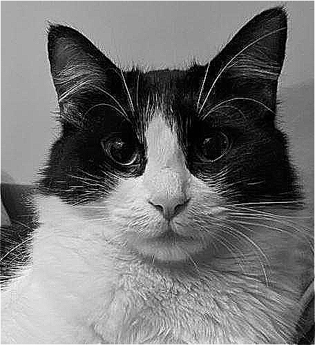
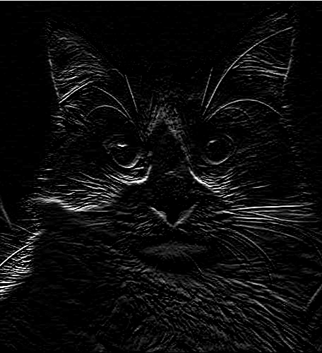

# Convolutional Image Filters

A C++ implementation of 2D convolutional image filters using sparse matrix operations and the Eigen library. This project demonstrates various image processing techniques including noise addition, smoothing, sharpening, and edge detection.

<p align="center">
  
  
  
  
</p>

## Features

- **Image Loading and Saving**: Supports JPEG/PNG formats using the STB library
- **Noise Generation**: Adds random noise to images for testing denoising algorithms
- **Sparse Matrix Convolution**: Efficient 2D convolution using sparse matrix representation
- **Multiple Filter Kernels**:
  - Smoothing filter (averaging kernel)
  - Sharpening filter (Laplacian kernel)
  - Edge detection (Sobel-like edge detection kernel)
- **Iterative Linear Solvers**: 
  - BiCGSTAB solver for image restoration
  - Support for external LIS (Library of Iterative Solvers) integration
- **Matrix Market Format**: Export/import matrices and vectors in MTX format

## Dependencies

- **Eigen3**: Linear algebra library for matrix operations
  - Dense matrices
  - Sparse matrices
  - Iterative linear solvers
- **STB**: Single-file public domain libraries for image I/O
  - stb_image.h (image loading)
  - stb_image_write.h (image writing)
- **C++ Standard Library**: iostream, vector, ctime, fstream

## Project Structure

```
.
├── code.cpp                    # Main source code
├── img/                        # Image directory
│   ├── uma.jpg                # Input image
│   ├── p_2.png                # Noisy image output
│   ├── p_5.png                # Smoothed image output
│   ├── p_7.png                # Sharpened image output
│   ├── p_9.png                # LIS solver result
│   ├── p_11.png               # Edge detected image output
│   └── p_13.png               # BiCGSTAB solver result
├── data/                       # Matrix data directory
│   ├── A2.mtx                 # Sparse matrix in Matrix Market format
│   └── w.mtx                  # Vector in Matrix Market format
├── stb/                        # STB library headers
│   ├── stb_image.h
│   └── stb_image_write.h
├── lis_solution/              # LIS solver outputs
│   ├── sol.mtx                # Solution vector
│   └── hist.txt               # Convergence history
└── description/               # Project description and documentation
```

## Image Processing Pipeline

### Step 1: Image Loading
- Loads `uma.jpg` and converts it to a matrix representation
- Image dimensions are stored as height × width

### Step 2: Noise Addition
- Generates random noise (uniformly distributed, scaled by 40)
- Adds noise to the original image
- Clamps pixel values to [0, 255] range
- Outputs: `p_2.png`

### Step 3: Vector Conversion
- Converts matrices to column vectors using row-major ordering
- `v`: vectorized original image
- `w`: vectorized noisy image

### Step 4-5: Smoothing Filter
- **Kernel (Hav1)**: 3×3 averaging kernel
  ```
  [1 1 0]
  [1 2 1] / 8
  [0 1 1]
  ```
- Builds sparse matrix A1 for 2D convolution
- Applies smoothing to noisy image: `w_filtered = A1 * w`
- Outputs: `p_5.png`

### Step 6-7: Sharpening Filter
- **Kernel (Hsh1)**: 3×3 Laplacian sharpening kernel
  ```
  [ 0 -2  0]
  [-2  9 -2]
  [ 0 -2  0]
  ```
- Builds sparse matrix A2
- Checks symmetry of the kernel
- Applies sharpening to original image
- Outputs: `p_7.png`

### Step 8-9: External Solver (LIS)
- Exports matrix A2 and vector w to Matrix Market format
- Can be solved using external LIS library with command:
  ```bash
  lis test1 data/A2.mtx data/w.mtx lis_solution/sol.mtx hist.txt -i cg -tol 1e-14 -p jacobi
  ```
- Imports and visualizes the solution
- Outputs: `p_9.png`

### Step 10-11: Edge Detection
- **Kernel (Hed2)**: 3×3 Sobel-like edge detection kernel
  ```
  [-1 -2 -1]
  [ 0  0  0]
  [ 1  2  1]
  ```
- Builds sparse matrix A3
- Detects vertical edges in the original image
- Outputs: `p_11.png`

### Step 12-13: BiCGSTAB Solver
- Creates matrix A4 = A3 + 3*I (edge detection + identity)
- Solves the linear system A4*x = w using BiCGSTAB iterative solver
- Tolerance: 1e-8
- Outputs: `p_13.png`

## Key Functions

### `sparseKernel()`
Constructs a sparse matrix representing 2D convolution with a given kernel:
- Handles boundary conditions (pixels outside the image are ignored)
- Uses triplet format for efficient sparse matrix construction
- Supports arbitrary kernel sizes

### `loadMtxVector()`
Loads a vector from Matrix Market coordinate format:
- Skips comment lines (starting with `%`)
- Reads coordinate-value pairs
- Returns an Eigen::VectorXd

## Output Files

All processed images are saved in the `./img/` directory:
- `p_2.png`: Noisy version of input image
- `p_5.png`: Smoothed image (noise reduction)
- `p_7.png`: Sharpened image (enhanced details)
- `p_9.png`: LIS solver result
- `p_11.png`: Edge-detected image
- `p_13.png`: BiCGSTAB solver result

## Mathematical Background

The program implements 2D convolution as matrix-vector multiplication:
- Each pixel's filtered value is a weighted sum of its neighbors
- The convolution kernel defines the weights
- Sparse matrices efficiently represent the convolution operator
- The sparse matrix has approximately (kernel_size × image_pixels) non-zero elements
